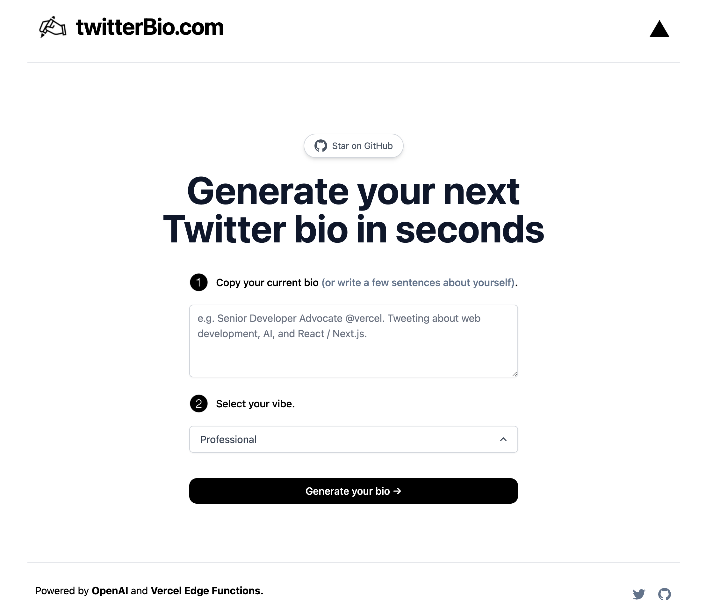

# [gamechanger.naumenko.ca](https://gamechanger.naumenko.ca/)

This project generates Twitter bios for you using AI.

[](https://gamechanger.naumenko.ca)

## How it works

This project uses the [ChatGPT API](https://openai.com/api/) and [Vercel Edge functions](https://vercel.com/features/edge-functions) with streaming.

## Running Locally

After cloning the repo, go to [OpenAI](https://beta.openai.com/account/api-keys) to make an account and put your API key in a file called `.env`.

Then, run the application in the command line and it will be available at `http://localhost:3000`.

```bash
npm run dev
```
